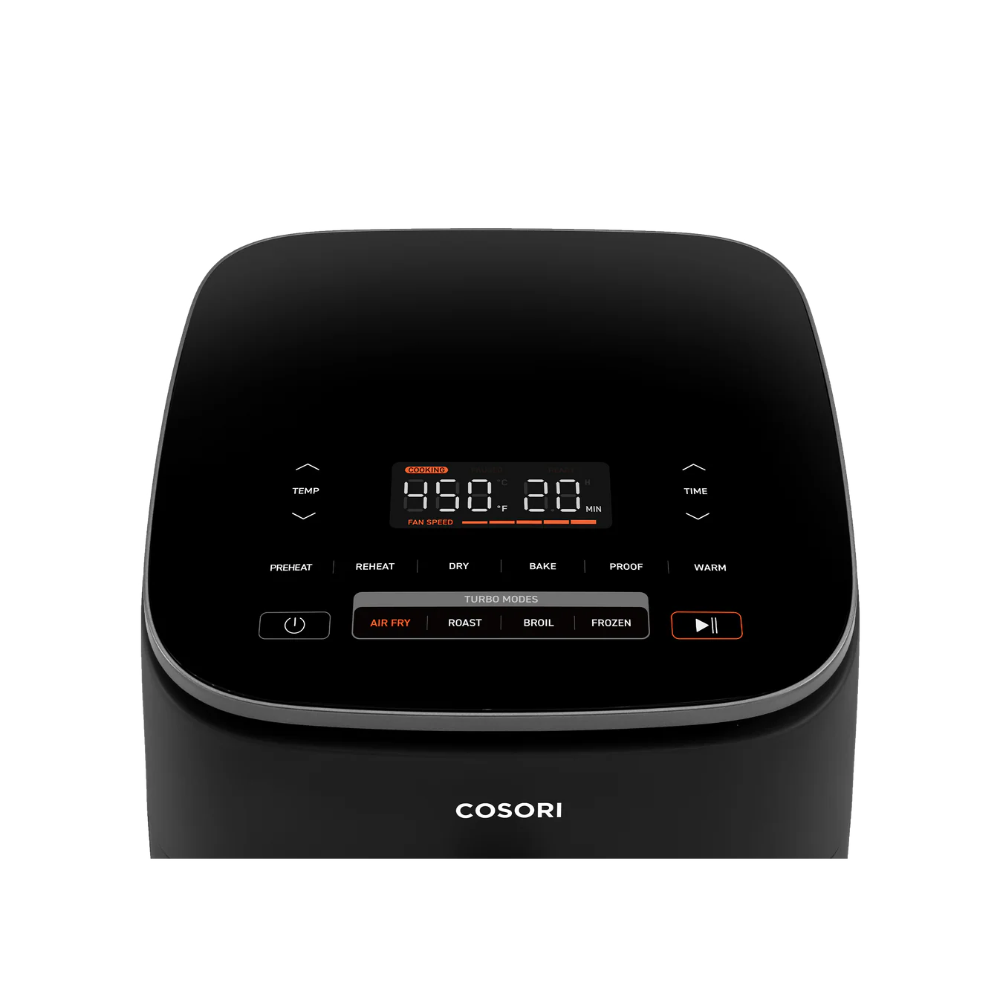

# 🔥 Spidr Air Fryer Interest Form

A visually rich, brand-inspired, single-page React app designed to capture user interest in Spidr’s (fictional) next-gen air fryer. Built to reflect the style and spirit of [Spidr Design](https://spidr.design).



---

## ✨ Features

- 🎥 Full-screen promotional background video
- 🧾 Elegant interest form with custom fields:
  - First Name
  - Last Name
  - Phone Number
  - Email Address
  - Cost Guess (in USD)
  - Spidr 16-digit PIN (auto-formatted like `####-####-####-####`)
- 🔊 Custom audio feedback on submission (`airfryer.mp3`)
- 🖼️ Animated, styled air fryer background image
- 💅 Styled using Tailwind CSS to match Spidr Design’s identity
- 📱 Fully responsive and mobile-friendly

---

## 🚀 Getting Started

### 1. Clone the Repository
```bash
git clone https://github.com/your-username/spidr-airfryer-form.git
cd spidr-airfryer-form
```

### 2. Install Dependencies
```bash
npm install
```

### 3. Start the Development Server
```bash
npm start
```

App will run at: `http://localhost:3000`

---

## 🛠️ Tech Stack

- **React** – Frontend framework
- **Tailwind CSS** – Utility-first styling
- **HTML5 Video/Audio** – Media handling
- **JavaScript** – State handling and input formatting

---

## 📁 Project Structure

```
public/
├── airfryer.mp3         # Audio clip for feedback
├── airfryer.png         # Image shown near the form
├── top.png              # Overlay image on form reveal
├── Videos.mp4           # Background promotional video
└── index.html

src/
├── App.js               # Main component logic
├── index.js             # Entry point
└── index.css            # Tailwind and custom animation styles
```

---

## ✅ Improvements & TODOs

- Add form validation or API integration
- Animate form fields on entry
- Enhance accessibility (ARIA labels, focus states)
- Add loader/spinner during audio playback (optional)

---

## 📄 License

This project is created for demo purposes and has no official affiliation with Spidr Design.

---

## 🙏 Acknowledgements

Inspired by the visual identity and playful UI/UX of [Spidr Design](https://spidr.design).
